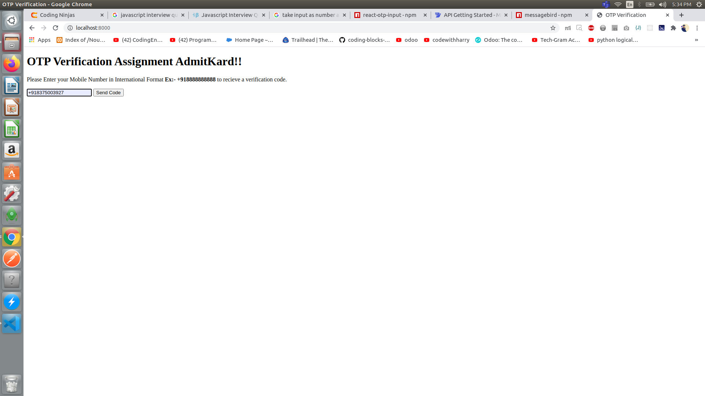
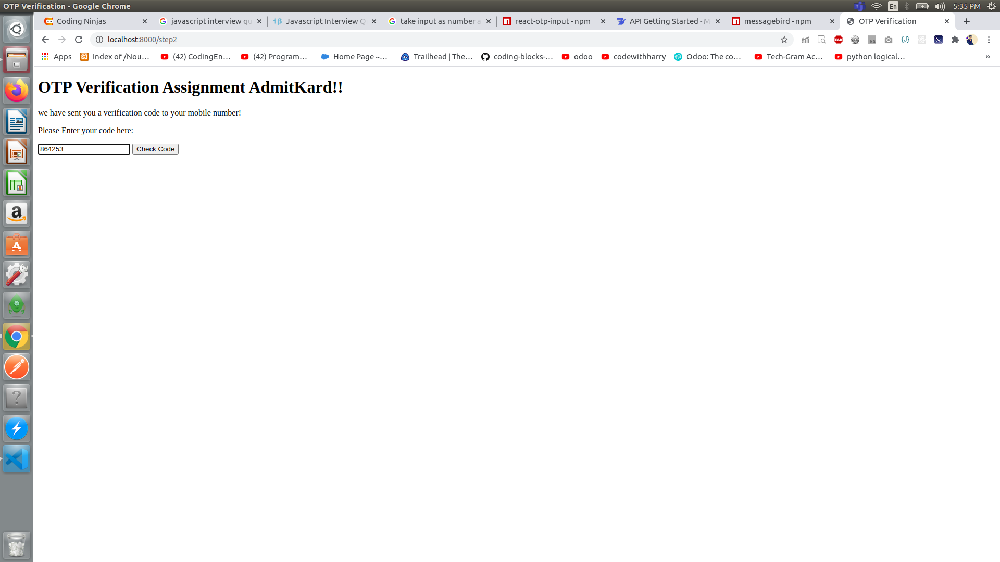
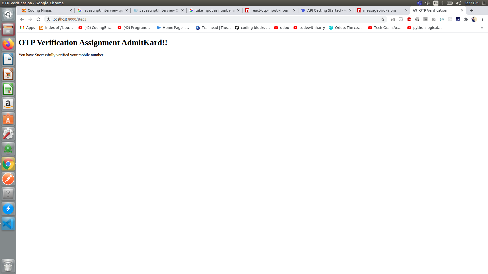
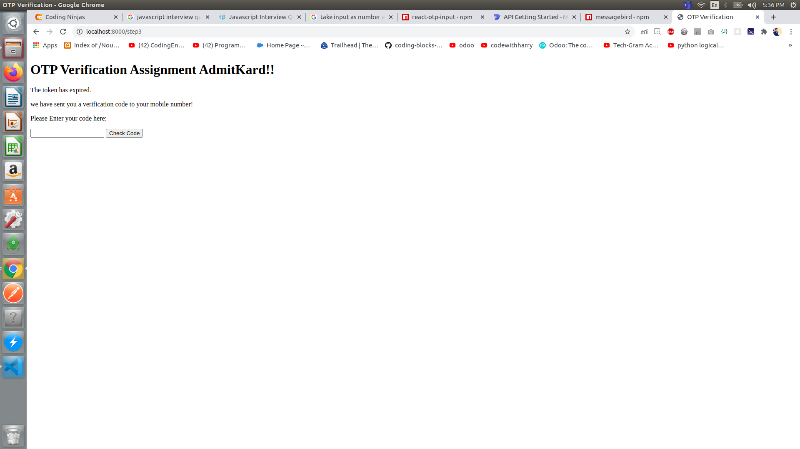

# AdmitKardAssing
Mobile Number OTP verification | Experss.js | Messagebird Api

# -Mobile Number OTP Verification | AdmitKard

I have used espress.js to complete this task, with the help of Messagebirs Restfull API.

# - How to use this app
1. clone it
2. open this folder on teminal
3. Enter npm install
4. npm start

# How it's look like
I have not used any css file to make better UI, here we can do lot more improvements.

# STEPS

1. Enter Mobile Number
http://localhost:8000

2. Enter the OTP

3. OTP verified

# Session Handling

I make this task for Fullstack Developer-1, i have used handlebars(due to complete it fast) as view engine there is lot more like ejs which we can use, to make this application we can use react
as well.
